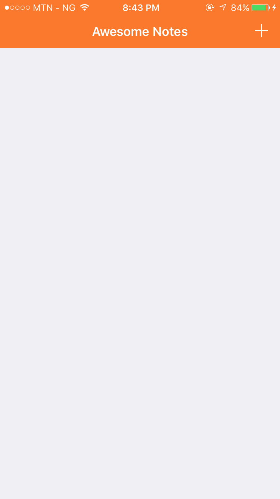

# Awesome_Notes
Note taking app for travellers I made to learn Swift 3 and iOS 10 core data!

## Awesome notes, a note taking taking app built for travellers  

Whats the best way of learning to use an API? deep dive it!

This app is my practice app for iOS 10 CoreData, I learnt a lot while writing it and it cemented my knowledge of autoLayout amongst other things, theres still some bugs to fix … One day sha!

## Technology Stack

Core Data

## Used libraries

**CoreData** - An API from apple used to manage data persistence in iOS

**MapKit** - Display and use maps in your iOS app bla bla bla.

## To do

**Fix bug for autorefresh** - after adding a new item… the app fails to refresh… it gives some kin cryptic error on how the number of rows after adding must be greater than the number before adding … I would love to stay and fix it but I want to move on in the course.

**MapKit** - Implement search … for the fun of it … it is NOT hard, I’m just a lazy negro.

License
----------------

The MIT License (MIT)

Copyright (c) 2017 Aliu Abdul-Mujib

Permission is hereby granted, free of charge, to any person obtaining a copy
of this software and associated documentation files (the "Software"), to deal
in the Software without restriction, including without limitation the rights
to use, copy, modify, merge, publish, distribute, sublicense, and/or sell
copies of the Software, and to permit persons to whom the Software is
furnished to do so, subject to the following conditions:

The above copyright notice and this permission notice shall be included in all
copies or substantial portions of the Software.

THE SOFTWARE IS PROVIDED "AS IS", WITHOUT WARRANTY OF ANY KIND, EXPRESS OR
IMPLIED, INCLUDING BUT NOT LIMITED TO THE WARRANTIES OF MERCHANTABILITY,
FITNESS FOR A PARTICULAR PURPOSE AND NONINFRINGEMENT. IN NO EVENT SHALL THE
AUTHORS OR COPYRIGHT HOLDERS BE LIABLE FOR ANY CLAIM, DAMAGES OR OTHER
LIABILITY, WHETHER IN AN ACTION OF CONTRACT, TORT OR OTHERWISE, ARISING FROM,
OUT OF OR IN CONNECTION WITH THE SOFTWARE OR THE USE OR OTHER DEALINGS IN THE
SOFTWARE.
